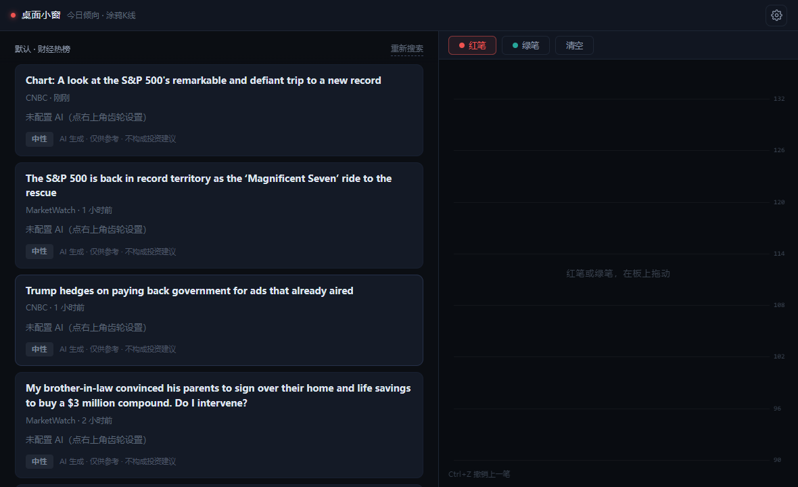
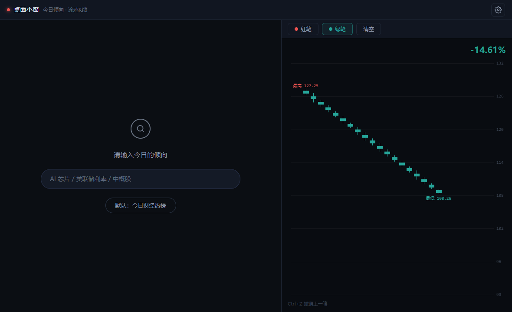
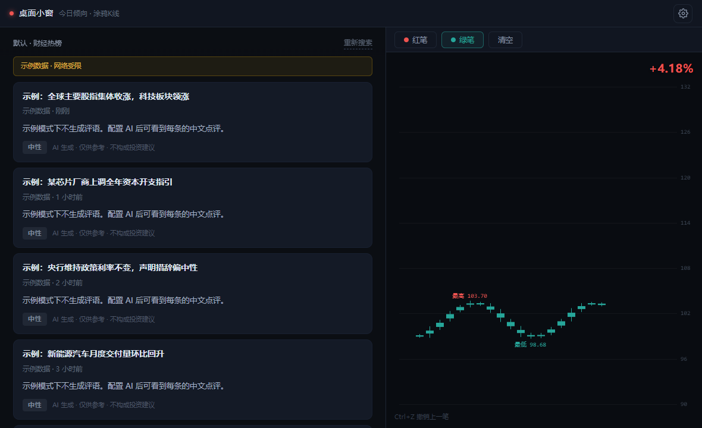
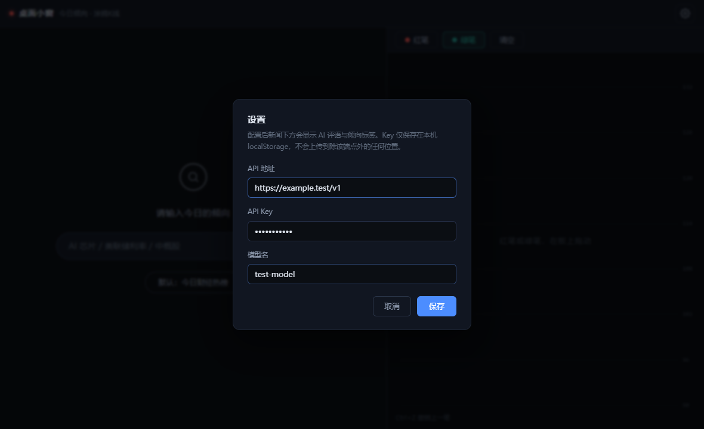

# 桌面小窗 · 今日倾向 + 涂鸦 K 线

一个 Windows 上双击即用的小程序。不用装任何东西，不出现浏览器地址栏和标签页，
就是一个独立的小窗口。体量很小（单文件 HTML，约 41 KB），断网也能玩。



## 怎么用

1. 下载或克隆本仓库
2. 双击 **`桌面小窗/启动.vbs`**

就这两步。Win10/11 出厂自带 Edge，不需要额外安装任何运行时。

## 窗口里有什么

左右分栏，各占一半。



**左栏 · 今日倾向**

谷歌主页式的极简搜索。要么直接在输入框写一个倾向（比如「AI 芯片」「美联储利率」「中概股」），
要么点下面的默认按钮取当日财经热榜。两条路进的是同一套管线。

出来的每条新闻都带：

- 中文标题 + 来源与时间
- 一两句 AI 评语（这条新闻说了什么、为什么值得注意）
- 倾向标签：`看多`（红）/ `看空`（绿）/ `中性`（灰），按国内习惯红涨绿跌
- 固定小字「AI 生成 · 仅供参考 · 不构成投资建议」

**右栏 · 涂鸦 K 线**

三个控件：红笔 / 绿笔 / 清空。就这三个。

- 按住拖动，拖动过程中蜡烛实时长出来
- 红笔长红蜡烛，绿笔长绿蜡烛；同一区域重画会覆盖，可以先红后绿画出「上涨后回调」
- 没画的区域留空
- 最高价、最低价有标注，右上角显示整段涨跌幅，右缘是价格刻度
- `Ctrl+Z` 撤销上一笔

这部分**完全离线**，不接任何行情接口，所有价格都是本地合成的。

## 数据从哪来

内置四个公开 RSS 源：Yahoo Finance、CNBC、MarketWatch、Investing.com。

每个源的抓取顺序是：直连 → CORS 代理 → 放弃该源（不阻塞其他源），全部请求 10 秒超时。
四个源全挂时会退回内置的示例数据，界面上标注「示例数据 · 网络受限」，不会白屏。



合并后按标题相似度去重，只保留最近 24 小时的新闻（不足 10 条时放宽到 48 小时），
再按本地热度排序取前 10：

```
热度 = 跨源出现次数 × 3 + 源内位置权重 + 时间新近度
```

热度是纯本地算的，不花模型的钱。只有在自定义倾向模式下，才会额外发一次模型请求，
让模型给每条候选打一个 0-100 的相关度，再取前 10。

结果按「日期 + 模式」缓存进 localStorage，当天重复打开直接出结果。
点「重新搜索」会清掉当前缓存并强制刷新。

## AI 评语要不要配 Key

不配也能用。新闻列表照常显示，评语位置显示「未配置 AI（点右上角齿轮设置）」。

配了之后评语才会生成。点右上角齿轮填三项：API 地址、API Key、模型名。



Key 只存在你自己电脑的 localStorage 里，只在请求时放进 `Authorization` 头，
不写进代码、不写进日志，也不会发到 LLM 端点以外的任何地方。

评语是**一次批量请求**处理 10 条，不会一条新闻调一次 API。

## 目录结构

```
桌面小窗/
├── index.html          全部界面与逻辑，单文件，零依赖
├── 启动.vbs            双击这个 = 打开小程序
└── 使用说明.txt        两行字说明
```

技术上是本地 HTML + Edge `--app` 模式启动器。没有用 Electron / Tauri
（要装 Node/Rust 工具链，构建出来几十上百 MB），也没有用 `.hta`（IE 内核，
不支持现代 JS 和 canvas）。

## 已知限制

- 依赖公共 CORS 代理。公共代理时好时坏，所以失败会自动换端点重试；
  真全挂了就走示例数据。这种情况下 F12 里能看到浏览器层面的 CORS 报错，
  但不会有脚本报错，也不会白屏。
- RSS 里的标题原文多为英文，配置 AI 后会被翻成中文；没配 AI 时显示原文。
- 只做了 Windows + Edge 的验证，其他浏览器没测。

## 免责声明

本项目仅为个人学习与娱乐用途的桌面小工具。所有 AI 生成的评语与倾向标签
均为程序自动生成，**仅供参考，不构成任何投资建议**。据此操作，风险自负。